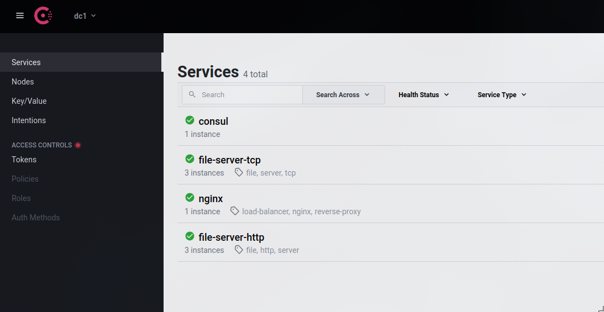

# TCP File Streaming Service

This project is a TCP file streaming service designed to handle file transfers over a network. It includes several components that work together to provide a robust and scalable solution for streaming files.

## Components

1. **NGINX**: Acts as a reverse proxy, handling incoming HTTP requests and forwarding them to the appropriate backend services.
2. **Golang HTTP Service**: A backend service written in Go that handles HTTP requests for file streaming. It listens on ports 8081 and 8080.
3. **Consul**: A service discovery and configuration tool that helps manage the services and their health checks.
4. **TCP Streaming Service**: Handles the actual file streaming over TCP, listening on port 8080.

## API Endpoints

- **GET /health**: Health check endpoint to verify the service is running.
- **POST /stream?size=169**: Endpoint to initiate a file stream of a specified size.

## Architecture

The architecture consists of a public network where NGINX is deployed and an internal network where the Golang HTTP service, TCP Streaming Service, and Consul are deployed. NGINX forwards requests to the Golang service, which interacts with Consul for service discovery and health checks. The TCP Streaming Service handles the actual file streaming.


## Consul

Consul is used for service discovery and health checks. It helps manage the services by registering them and monitoring their health status. This ensures that the services are available and functioning correctly, and it allows for dynamic configuration and scaling of the services.



## Usage

### Requirements

- Docker[https://www.docker.com/get-started/]
- Docker Compose[https://docs.docker.com/compose/]
- curl[https://curl.se/]

### Setup

1. **Clone the repository**:

    ```sh
    git clone https://github.com/zvdy/tcp-file-streaming.git
    cd tcp-file-streaming-service
    ```

2. **Start the services using Docker Compose**:

    ```sh
    docker-compose up -d
    ```

3. **Verify that the services are running**:

    ```sh
    docker-compose ps
    ```

### Running the Service

1. **Check the health of the Golang HTTP Service**:

    ```sh
    curl http://localhost/health
    ```

2. **Initiate a file stream**:

    ```sh
    curl -X POST "http://localhost/stream?size=169"
    ```

### Testing

1. **Run tests**:

    ```sh
    go test ./...
    ```

2. **Check Consul UI**:
    Open your browser and navigate to `http://localhost:8500` to view the Consul UI and check the registered services and their health status.
